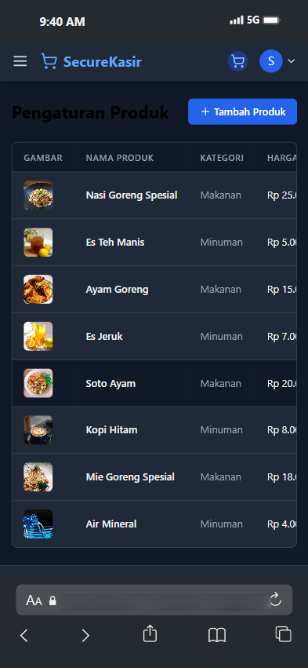
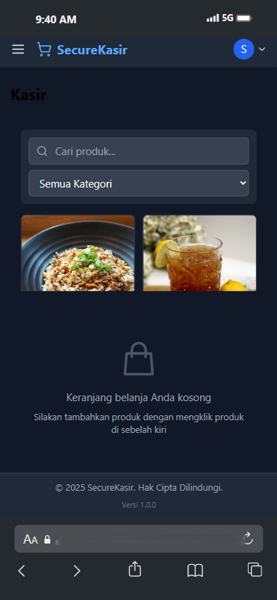
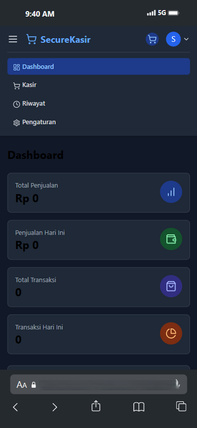
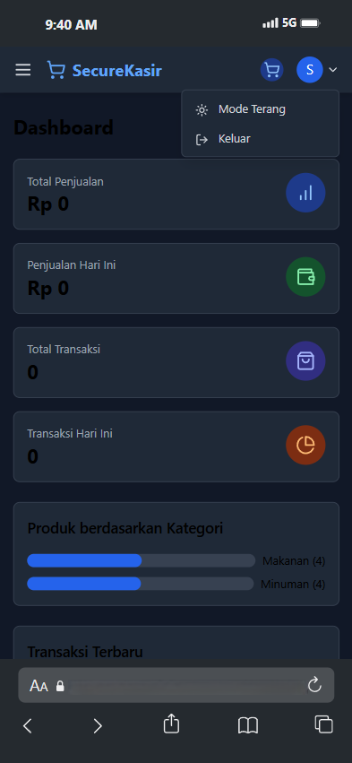

# SecureKasir

SecureKasir adalah aplikasi kasir modern berbasis web yang dapat digunakan secara offline. Aplikasi ini dirancang untuk memenuhi kebutuhan bisnis kecil hingga menengah dengan antarmuka yang intuitif dan fitur-fitur yang komprehensif.

## Fitur Utama

- 💼 **Manajemen Produk**
  - Tambah, edit, dan hapus produk
  - Kategorisasi produk
  - Manajemen stok
  - Upload gambar produk

- 🛒 **Transaksi**
  - Antarmuka kasir yang intuitif
  - Perhitungan otomatis
  - Diskon per transaksi
  - Pembayaran tunai dan QRIS
  - Cetak struk

- 📊 **Dashboard**
  - Ringkasan penjualan
  - Statistik produk
  - Grafik kategori
  - Transaksi terbaru

- 📱 **Responsif**
  - Tampilan optimal di desktop dan mobile
  - Mode gelap/terang
  - Navigasi yang mudah

## Teknologi

- React 18
- TypeScript
- Tailwind CSS
- React Router
- Lucide Icons
- Vite
- LocalStorage untuk penyimpanan data

## Screenshots

### Dashboard


Tampilan dashboard menampilkan ringkasan penjualan, statistik produk berdasarkan kategori, dan daftar transaksi terbaru. Dilengkapi dengan kartu informasi yang menampilkan total penjualan, penjualan hari ini, total transaksi, dan transaksi hari ini.

### Halaman Kasir


Antarmuka kasir yang intuitif dengan katalog produk di sebelah kiri dan keranjang belanja di sebelah kanan. Mendukung pencarian produk, filter kategori, dan perhitungan otomatis termasuk diskon.

### Manajemen Produk


Halaman pengaturan produk memungkinkan pengguna untuk menambah, mengedit, dan menghapus produk. Setiap produk dapat dikategorikan dan dilengkapi dengan gambar.

### Riwayat Transaksi


Halaman riwayat menampilkan seluruh transaksi yang telah dilakukan. Dilengkapi dengan fitur pencarian, filter tanggal, dan kemampuan untuk mencetak ulang struk.

### Mode Gelap


Aplikasi mendukung mode gelap untuk kenyamanan penggunaan di kondisi cahaya rendah.

## Instalasi

1. Clone repositori
   ```bash
   git clone https://github.com/zdgdev/SecureKasir.git
   ```

2. Masuk ke direktori proyek
   ```bash
   cd SecureKasir
   ```

3. Install dependensi
   ```bash
   npm install
   ```

4. Jalankan aplikasi
   ```bash
   npm run dev
   ```

## Penggunaan

1. **Dashboard**
   - Lihat ringkasan penjualan
   - Monitor statistik produk
   - Pantau transaksi terbaru

2. **Kasir**
   - Pilih produk dari katalog
   - Atur jumlah item
   - Terapkan diskon
   - Proses pembayaran
   - Cetak struk

3. **Manajemen Produk**
   - Tambah produk baru
   - Edit informasi produk
   - Hapus produk
   - Atur kategori

4. **Riwayat Transaksi**
   - Lihat semua transaksi
   - Filter berdasarkan tanggal
   - Cari transaksi spesifik
   - Cetak ulang struk

## Kontribusi

Kami sangat menghargai kontribusi dari komunitas. Jika Anda ingin berkontribusi:

1. Fork repositori
2. Buat branch fitur (`git checkout -b fitur-baru`)
3. Commit perubahan (`git commit -m 'Menambah fitur baru'`)
4. Push ke branch (`git push origin fitur-baru`)
5. Buat Pull Request

## Lisensi

Proyek ini dilisensikan di bawah [MIT License](LICENSE)

## Kontak
- Website: [https://github.com/zdgdev](https://github.com/zdgdev)
